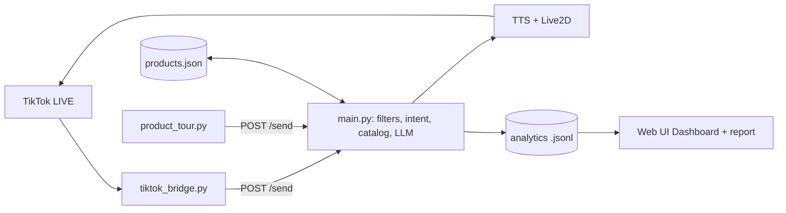

# ai-live - AI 2D streamer for TikTok LIVE shopping

A fork of [Luna AI / AI-Vtuber](https://github.com/Ikaros-521/AI-Vtuber), translated to English and adapted into an
automatic TikTok LIVE seller:

- Introduces **every product in the cart**, one after another, in a loop (`product_tour.py`).
- **Replies to viewer comments** with an LLM, grounded in your product catalog.
- **TikTok-safe**: every viewer comment and every sentence the AI is about to say passes a Vietnamese-aware policy
  filter (`utils/tiktok_safety.py`) - off-platform contacts/payments, profanity, scams, medical/absolute claims, and so on.
- **Quick answers**: simple price/size/colour/shipping/returns/usage/FAQ questions are answered straight from the catalog (no LLM, nothing invented); anything else goes to the LLM with product context.
- **Vietnamese locale pack**: `python apply_locale.py data/locale_vi.json` switches every spoken template and trigger word in `config.json` to Vietnamese (code and UI stay English).
- Tour extras: AI disclosure line, follow/ask/cart reminders between products, `"active": false` to skip sold-out items.
- Speaks Vietnamese (edge-tts `vi-VN-HoaiMyNeural`) and drives a Live2D avatar; the codebase and UI are English.

## Why sellers use it

- **Sells while you rest**: tours the whole cart on a loop, answers price / size / shipping / returns instantly from your own catalog.
- **Turns buying signals into action**: "chốt đơn", "lấy 1 cái" and similar comments get a call-to-action that points to the cart item.
- **Stays inside TikTok's rules**: two-way compliance filter, AI-disclosure line, no off-platform contact or payment talk.
- **Auto-spotlight**: when 3+ viewers ask about the same product within 5 minutes, the AI pitches it again (`products.spotlight` in `config.json`, 10 min cooldown).
- **Starts in minutes**: one launcher, a setup wizard, and a simulator so you can try it before going live.
- **Shows what worked**: Dashboard tab and `python report_session.py` list what viewers asked, which products drew interest and what the filter caught.
- **Cheap to run**: quick answers skip the LLM entirely.

## Architecture

Full write-up with the message pipeline, module table and roadmap: [docs/ARCHITECTURE.md](docs/ARCHITECTURE.md).

## Quick start (sellers)

1. Install Python 3.10+ and run `pip install -r requirements.txt` once.
2. Double-click **`start.bat`** (or `python launcher.py`). It starts the app and opens the control panel.
3. Follow the **Setup** tab: shop and TikTok username, upload your products (CSV/XLSX), pick a voice and persona, run the dry run, press **Start**.
   The first Start creates the TikTok bridge environment (`venv_tt`) automatically.
4. Go LIVE on TikTok. The AI introduces your cart in a loop and answers viewers.

No TikTok account handy? `python simulate_live.py --offline` shows what the bot does with demo viewers (spam, contact requests,
price questions, buying signals), and `python simulate_live.py` replays them into the running app so the avatar speaks.

Manual route for developers: `python main.py`, then `python webui.py`, then in the bridge venv
`python tiktok_bridge.py YOUR_TIKTOK_USERNAME --gifts --joins`, then `python product_tour.py` (flags: `--gap`, `--pause`, `--rounds`, `--once`, `--cps`).

## More seller tools

- **Flash sale** (Live tools tab): pick a product, minutes, optional sale price and stock. The AI announces the time left on a schedule and in the last minute. It only says what you entered and passes the safety filter.
- **Shoutouts**: thank-you lines for gifts, follows and joins mention the viewer and the product on screen (`{username}`, `{product}` in `config.json -> thanks`).
- **Draft with AI** (Products tab): the LLM drafts aliases, a description, highlights and the questions viewers will ask. You review and apply; nothing is saved automatically, and drafts are safety-filtered.
- **Personas** (`data/personas.json`): friendly girl, cheerful host, calm expert. Each sets voice, speed, speaking style and avatar while keeping the compliance rules.

## Getting the cart into the catalog

TikTok does **not** push the whole shopping cart over the live websocket - only the product currently pinned/popped up
(title, price, image, id) and the total product count. So there are two ways to fill `data/products.json`:

1. **Pin products during the live (automatic).** `tiktok_bridge.py` forwards each pinned product to the app
   (`type: "product"`). The app matches it to your catalog (by TikTok id, then by title) or adds it as
   `"auto_imported": true`, logs `Live cart reports N products, catalog has M`, and - with `products.pitch_on_pop` -
   immediately pitches it. Details you wrote by hand are never overwritten. Settings: `products.auto_add`,
   `products.pitch_on_pop`, `products.pitch_on_pop_cooldown` (seconds).
2. **Import a spreadsheet (before the live).** Export your products from Seller Center (or use your own sheet) and run
   `python import_products.py export.xlsx` (CSV works too; `.xlsx` needs `pip install openpyxl`). English and Vietnamese
   headers are recognised; existing entries are updated, new ones appended; `--dry-run` previews.

Auto-imported products only have a name and price, so add `highlights`, `faq`, etc. by hand for better pitches.
Run the bridge with `--debug-cart cart.jsonl` once in a real live to capture the raw shopping events: TikTok's
`OecLiveShoppingMessageV2` may carry more product detail, and that file shows what is available.
3. **TikTok Shop Partner API (seller account).** `python sync_shop_products.py [--details] [--dry-run]` pulls the real catalog; put credentials in `tiktok_shop_credentials.json` or `TTS_*` env vars. Needs an approved app; not yet verified against a live shop.

## Configuration

- `config.json -> products`: enable/disable catalog grounding, paths, the text placed before product facts in the LLM prompt.
- `config.json -> filter -> tiktok_safety`: enable the policy filter and set `terms_path`.
- `config.json -> before_prompt`: the host persona and compliance rules sent to the LLM (Vietnamese replies, no contacts, no claims).
- `data/tiktok_policy_terms.json`: the banned-term categories. `scope` is `input` (viewer comments), `output` (AI speech) or `both`;
  `action` is `drop` or `mask`. Categories marked `accent_sensitive` keep Vietnamese tone marks to avoid false positives
  (e.g. "deo" vs "dao"). Review this list regularly - TikTok's enforcement is not public and changes.
- `data/pitch_templates.json`: spoken Vietnamese templates for product pitches.

## Compliance notes

- The AI should be disclosed as AI-generated content according to TikTok's current LIVE rules.
- Pitches are built only from catalog fields; keep them honest and free of medical/absolute claims.
- Never put phone numbers, Zalo/Facebook, links or bank details in the catalog; the filter will drop them anyway.
- License: GPL-3.0 (see `LICENSE`). The upstream project also asks commercial users to contact the author; check this before selling.

## Tests

`python -m py_compile` over the sources, and see `tests/` for per-backend API experiments inherited from upstream.

## Catalog tools

- **Products tab** (web UI): edit the catalog, import CSV/XLSX, say a pitch now, test comment replies.
- `python sync_shop_products.py [--details] [--dry-run] [--status]`: pull products from the TikTok Shop Partner API. Put credentials in `tiktok_shop_credentials.json` (git-ignored) or `TTS_*` env vars. Not yet verified against a real shop.
- Tests: `python -m pytest tests/unit`

## Supported platforms

Only `talk`, `tiktok`, `youtube` and `twitch` remain; the Chinese-platform listeners (Bilibili, Douyin, Kuaishou, WeChat, etc.) were removed. Their old config sections in `config.json` are unused.

## Live analytics

Every comment, answer, blocked message and pitch is logged to `log/analytics/session-*.jsonl` (viewer names are salted hashes).
View it in the web UI **Dashboard** tab, or run `python report_session.py [--out report.md]` after the live.
Toggle with `config.json -> analytics.enable`.
