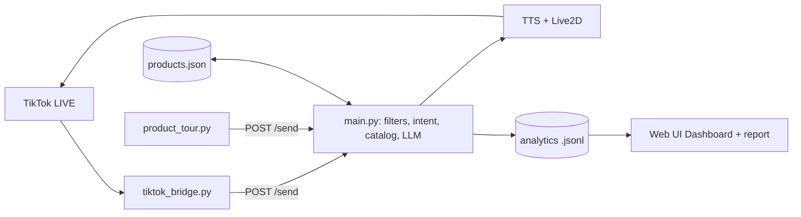

# ai-live - AI 2D streamer for TikTok LIVE shopping

A fork of [Luna AI / AI-Vtuber](https://github.com/Ikaros-521/AI-Vtuber), translated to English and adapted into an
automatic TikTok LIVE seller:

- Introduces **every product in the cart**, one after another, in a loop (`product_tour.py`).
- **Replies to viewer comments** with an LLM, grounded in your product catalog.
- **TikTok-safe**: every viewer comment and every sentence the AI is about to say passes a Vietnamese-aware policy
  filter (`utils/tiktok_safety.py`) - off-platform contacts/payments, profanity, scams, medical/absolute claims, and so on.
- **Quick answers**: simple price/size/colour/shipping/returns/usage/FAQ questions are answered straight from the catalog (no LLM, nothing invented); anything else goes to the LLM with product context.
- **Vietnamese locale pack**: `python apply_locale.py data/locale_vi.json` switches every spoken template and trigger word in `config.json` to Vietnamese (code and UI stay English).
- Tour extras: AI disclosure line, follow/ask/cart reminders between products, `"active": false` to skip sold-out items.
- Speaks Vietnamese (edge-tts `vi-VN-HoaiMyNeural`) and drives a Live2D avatar; the codebase and UI are English.
- **Not only selling**: the same AI host can read a story aloud on your live (**Novel reader**), tell picture stories and make recap videos
  (**Story studio**), and write a whole novel with you (**Novel writer**). See [Stories on your live](#stories-on-your-live).

## Why sellers use it

- **Sells while you rest**: tours the whole cart on a loop, answers price / size / shipping / returns instantly from your own catalog.
- **Turns buying signals into action**: "chốt đơn", "lấy 1 cái" and similar comments get a call-to-action that points to the cart item.
- **Stays inside TikTok's rules**: two-way compliance filter, AI-disclosure line, no off-platform contact or payment talk.
- **Auto-spotlight**: when 3+ viewers ask about the same product within 5 minutes, the AI pitches it again (`products.spotlight` in `config.json`, 10 min cooldown).
- **Starts in minutes**: one launcher, a setup wizard, and a simulator so you can try it before going live.
- **Shows what worked**: Dashboard tab and `python report_session.py` list what viewers asked, which products drew interest and what the filter caught.
- **Cheap to run**: quick answers skip the LLM entirely.

## Architecture

Full write-up with the message pipeline, module table and roadmap: [docs/ARCHITECTURE.md](docs/ARCHITECTURE.md).

## Quick start (sellers)

1. Install **Python 3.10 or 3.11** (3.12+ is not supported by the pinned packages), then once:
   `py -3.11 -m venv venv` and `venv\Scripts\python.exe -m pip install -r requirements-lite.txt`.
   `start.bat` uses `venv` automatically. (`requirements.txt` is the original full list and has conflicting pins.)
2. Double-click **`start.bat`** (or `python launcher.py`). It starts the app and opens the control panel.
3. Follow the **Setup** tab: shop and TikTok username, upload your products (CSV/XLSX), pick a voice and persona, run the dry run, press **Start**.
   The first Start creates the TikTok bridge environment (`venv_tt`) automatically.
4. Go LIVE on TikTok. The AI introduces your cart in a loop and answers viewers.

No TikTok account handy? `python simulate_live.py --offline` shows what the bot does with demo viewers (spam, contact requests,
price questions, buying signals), and `python simulate_live.py` replays them into the running app so the avatar speaks.

Manual route for developers: `python main.py`, then `python webui.py`, then in the bridge venv
`python tiktok_bridge.py YOUR_TIKTOK_USERNAME --gifts --joins`, then `python product_tour.py` (flags: `--gap`, `--pause`, `--rounds`, `--once`, `--cps`).

## More seller tools

- **Flash sale** (Live tools tab): pick a product, minutes, optional sale price and stock. The AI announces the time left on a schedule and in the last minute. It only says what you entered and passes the safety filter.
- **Shoutouts**: thank-you lines for gifts, follows and joins mention the viewer and the product on screen (`{username}`, `{product}` in `config.json -> thanks`).
- **Draft with AI** (Products tab): the LLM drafts aliases, a description, highlights and the questions viewers will ask. You review and apply; nothing is saved automatically, and drafts are safety-filtered.
- **Giveaways and polls** (Live tools): one entry per viewer, uniform random draw, announced by the host and shown on the overlay (`utils/engage.py`).
- **Background music** (Live tools): only tracks with a safe licence are played, CC BY credits appear on screen ([docs/MUSIC.md](docs/MUSIC.md)).
- **Teach** tab: the questions the host was unsure about; type the answer once and it says exactly that next time (through the safety filter).
- **Schedule** tab: one-click live-room templates and coverage hours (when you host, when the AI hosts).
- **Sound like me** (Voice tab): clone your own voice locally from a short clip, with a consent record.
- **Welcome back** (opt-in): recognises returning viewers by a salted hash only; "Forget all viewers" erases it.
- **Personas** (`data/personas.json`): friendly girl, cheerful host, calm expert. Each sets voice, speed, speaking style and avatar while keeping the compliance rules.

## Avatar studio and seller brain

Free AI-drawn seller characters on the overlay (local Stable Diffusion + Animagine XL 3.1, or your own pictures): 8 ready-made originals or your own, outfits, 14 expressions that follow the live, stage options, a level / streak / achievements journey, a Pause / Take-over switch, and catalog-only answers for compare, budget and price/trust doubts. Details and limits: [docs/AVATAR.md](docs/AVATAR.md).

**AI engine** (sidebar tab): the AI reply gets a timeout, an optional fallback provider and a breaker, so one slow provider cannot stall the stream; repeated voice lines come from a cache; reply and voice speed are shown, and the pre-live check warns when replies are slow. Providers are loaded only when used, so the panel starts faster. The avatar blinks, pops and sparkles when its mood changes, and shows a live caption in time with the voice. The panel mascot can be chosen (cat, fox, bunny, panda), reacts when you go live, and the layout works better on phones.

## Stories on your live

Three tabs turn the host into a storyteller, which keeps viewers watching and is a second way to grow a channel. The AI is the
OpenAI-compatible one from Settings (Ollama, LM Studio, OpenAI, ...) and is called **directly: no Start Run needed to write**; a
7B+ model is recommended, bigger for the plot. Every spoken line goes through the TikTok safety filter, and a story needs a licence
you may use on a live (public domain, your own, CC0 / CC BY, or written permission). Details: [docs/NOVEL.md](docs/NOVEL.md), [docs/STORY.md](docs/STORY.md).

- **Novel reader**: add a story (paste, .txt, .epub), pick narrator / dialogue / per-character voices, press Start. It reads chapter after
  chapter, resumes where you stopped, shows the line on the overlay, and always yields to viewer comments.
  - Viewers steer with comments (opt-in): `!tiep` / `!lai` / `!truoc` need several different viewers; an end-of-chapter vote (1 = next, 2 = again).
  - **Companion** sub-tab (AI, no spoilers): viewers ask `!hoi <question>` and the host answers only from what has been read so far;
    an AI "previously on ..." recap, chapter summaries, character cards, and reading stats with a day streak.
  - Search, bookmarks, pronunciation dictionary, sleep timer, audiobook MP3 export.
- **Novel writer**: a long-form workspace, not a "generate" button. Premise options, story bible (characters with goal / fear / flaw / secret),
  editable outline, chapter-by-chapter drafting with narrative memory, a thread / foreshadowing tracker, local checks and an AI continuity audit,
  revise-with-a-diff, version history, approve / lock, steering the next chapter, a "where we left off" card, Markdown export, and
  **Publish to the Novel reader**. Projects are private files in `data/novel_projects/`.
- **Story studio**: write a short picture story with the AI (pitch, bible, beats, polish, continuity repair), add your own pictures, and the host
  tells it live or you export a **video** (vertical or wide, zoom / pan, fades, music, thumbnail, YouTube title / chapters / checklist).
  Step 3b turns manhua / webtoon pages into a recap script with OCR and a faithful translation. It never downloads from pirate sites.

Optional installs for stories: `pip install Pillow imageio-ffmpeg` (video, audiobook), `pip install rapidocr-onnxruntime` (OCR on pictures).

## Getting the cart into the catalog

TikTok does **not** push the whole shopping cart over the live websocket - only the product currently pinned/popped up
(title, price, image, id) and the total product count. So there are two ways to fill `data/products.json`:

1. **Pin products during the live (automatic).** `tiktok_bridge.py` forwards each pinned product to the app
   (`type: "product"`). The app matches it to your catalog (by TikTok id, then by title) or adds it as
   `"auto_imported": true`, logs `Live cart reports N products, catalog has M`, and - with `products.pitch_on_pop` -
   immediately pitches it. Details you wrote by hand are never overwritten. Settings: `products.auto_add`,
   `products.pitch_on_pop`, `products.pitch_on_pop_cooldown` (seconds).
2. **Import a spreadsheet (before the live).** Export your products from Seller Center (or use your own sheet) and run
   `python import_products.py export.xlsx` (CSV works too; `.xlsx` needs `pip install openpyxl`). English and Vietnamese
   headers are recognised; existing entries are updated, new ones appended; `--dry-run` previews.

Auto-imported products only have a name and price, so add `highlights`, `faq`, etc. by hand for better pitches.
Run the bridge with `--debug-cart cart.jsonl` once in a real live to capture the raw shopping events: TikTok's
`OecLiveShoppingMessageV2` may carry more product detail, and that file shows what is available.
3. **TikTok Shop Partner API (seller account).** `python sync_shop_products.py [--details] [--dry-run]` pulls the real catalog; put credentials in `tiktok_shop_credentials.json` or `TTS_*` env vars. Needs an approved app; not yet verified against a live shop.

## How the host presents products

Top to bottom, each product for 5-10 minutes (set in Setup, step 5, or per product with `duration_min`). The script is the
template intro, **your own intro line** (the `intro` field in the Products tab), price, facts and highlights; it repeats
with variations until the time is up, then moves on. A viewer comment always goes first: the host answers from your
product data, and once chat has been quiet for 2 seconds it continues the product where it stopped.

## Control panel

The web UI opens on **Home**: a readiness checklist with one-click fixes, a LIVE badge in the header when the TikTok bridge runs, last-session stats, and sidebar search across all settings. After a live, Home shows a recap with concrete "do this next live" tips, a streak and lives-this-week count. Dark and light themes. Tabs: Home, Setup, Dashboard, Teach, Schedule, Live tools, Novel reader, Novel writer, Story studio, Products, then Voice, AI model, TTS, avatar and the other settings.

**Language:** the panel is written in English. The **EN / VI** button next to the dark/light toggle switches it to Vietnamese (remembered in the browser). Translation is done in the page from `utils/i18n/vi.json`; text without an entry stays English, so some places can be mixed. To fix or add a Vietnamese string, edit that file (`exact` = English -> Vietnamese, `re` = templates with `$1`). The panel opens in your browser once via `start.bat`; run `python webui.py` by hand and open the address yourself.

## Voices (free)

Open the **Voice** tab to pick an engine and preview it.

- **Edge TTS** (default): free, no setup. Unofficial service with no SLA.
- **VieNeu-TTS v3 Turbo**: free, runs locally, Apache-2.0 (commercial use allowed, keep attribution, do not clone real people without consent). Start it with `python voice_server.py` (or the Start button in the Voice tab). The first run creates `venv_voice` and downloads the model. If the server is down, speech falls back to Edge TTS automatically.

Not used: VietTTS / viXTTS (non-commercial licenses).

## Configuration

- `config.json -> products`: enable/disable catalog grounding, paths, the text placed before product facts in the LLM prompt.
- `config.json -> filter -> tiktok_safety`: enable the policy filter and set `terms_path`.
- `config.json -> before_prompt`: the host persona and compliance rules sent to the LLM (Vietnamese replies, no contacts, no claims).
- `data/tiktok_policy_terms.json`: the banned-term categories. `scope` is `input` (viewer comments), `output` (AI speech) or `both`;
  `action` is `drop` or `mask`. Categories marked `accent_sensitive` keep Vietnamese tone marks to avoid false positives
  (e.g. "deo" vs "dao"). Review this list regularly - TikTok's enforcement is not public and changes.
- `data/pitch_templates.json`: spoken Vietnamese templates for product pitches.

## Compliance notes

- The AI should be disclosed as AI-generated content according to TikTok's current LIVE rules.
- Pitches are built only from catalog fields; keep them honest and free of medical/absolute claims.
- Never put phone numbers, Zalo/Facebook, links or bank details in the catalog; the filter will drop them anyway.
- License: GPL-3.0 (see `LICENSE`). The upstream project also asks commercial users to contact the author; check this before selling.

## Tests

`python -m pytest tests/unit` (about 240 offline tests: safety filter, catalog, stories, novel reader and writer, voices, analytics ...; the AI parts use scripted fake models).
`tests/` also holds per-backend API experiments inherited from upstream.

## Catalog tools

- **Products tab** (web UI): edit the catalog, import CSV/XLSX, say a pitch now, test comment replies.
- `python sync_shop_products.py [--details] [--dry-run] [--status]`: pull products from the TikTok Shop Partner API. Put credentials in `tiktok_shop_credentials.json` (git-ignored) or `TTS_*` env vars. Not yet verified against a real shop.

## Supported platforms

Only `talk`, `tiktok`, `youtube` and `twitch` remain; the Chinese-platform listeners (Bilibili, Douyin, Kuaishou, WeChat, etc.) were removed. Their old config sections in `config.json` are unused.

## Live analytics

Every comment, answer, blocked message and pitch is logged to `log/analytics/session-*.jsonl` (viewer names are salted hashes).
View it in the web UI **Dashboard** tab, or run `python report_session.py [--out report.md]` after the live.
Toggle with `config.json -> analytics.enable`.

## Credits

- Story and novel features take ideas from popular web-novel sites, AI reading apps and the open-source editor [steven-tey/novel](https://github.com/steven-tey/novel) (Apache-2.0); no code was copied.

- Home mascot: [page-mascot](https://github.com/nilbuild/page-mascot) by Kamran Ahmed (MIT), ported to plain JS in `utils/webui_mascot.py`. Sprite sheets and licence in `data/mascots/`.
