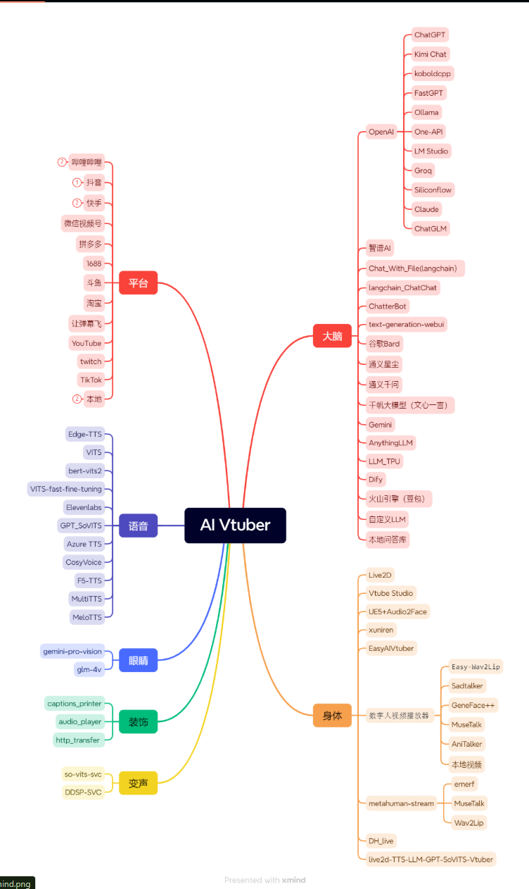

<div align="center">
  <a href="https://ikaros-521.github.io/Luna-Docs/site/">
    
  </a>
</div>

<div align="center">

# ✨ Luna AI  ✨


[![][python]][python]
[![][github-release-shield]][github-release-link]
[![][github-stars-shield]][github-stars-link]
[![][github-forks-shield]][github-forks-link]
[![][github-issues-shield]][github-issues-link]  
[![][github-contributors-shield]][github-contributors-link]
[![][github-license-shield]][github-license-link]
[![][FOSSA-Status]][FOSSA-Status]


</div>

`Luna AI` is a virtual AI streamer that combines cutting-edge technologies.它的核心是一系列高效的人工智能模型和平台，包括 `ChatterBot、GPT、Claude、langchain、chatglm、text-generation-webui、讯飞星火、智谱AI、谷歌Bard、通义星尘、阿里云百炼（通义千问、百川、月之暗面、零一万物、MiniMax）、千帆大模型（文心一言）、Gemini、Kimi Chat、koboldcpp、FastGPT、Ollama、One-API、AnythingLLM、LLM_TPU、Dify、火山引擎（豆包）`。These models can run locally or be powered by cloud services. To bring conversations into the real world, it also integrates multimodal models, including `Gemini、glm-4v` for image recognition, allowing it to capture and analyze the computer screen.  

`Luna AI`'s appearance is built using `Live2D、Vtube Studio、xuniren、UE5 结合 Audio2Face、EasyAIVtuber、数字人视频播放器（Easy-Wav2Lip、Sadtalker、GeneFace++、MuseTalk、AniTalker、本地视频）、metahuman-stream（ernerf、musetalk、wav2lip）、DH_live、live2d-TTS-LLM-GPT-SoVITS-Vtuber` technologies, providing users with a vivid and interactive virtual avatar.This allows `Luna AI` 能够在各大直播平台，如 `Bilibili、抖音、快手、微信视频号、拼多多、1688、斗鱼、淘宝、让弹幕飞、YouTube、Twitch 和 TikTok`，to conduct real-time interactive livestreams.It can also have personalized conversations with you in a local environment.

To make communication more natural,`Luna AI` uses advanced natural language processing technologies combined with text-to-speech systems such as `Edge-TTS、VITS-Fast、elevenlabs、VALL-E-X、睿声AI、OpenVoice、GPT_SoVITS、clone-voice、Azure TTS、fish-speech、ChatTTS、CosyVoice、F5-TTS、MultiTTS、MeloTTS`This not only allows it to generate fluent responses, but also enables voice conversion through `so-vits-svc 和 DDSP-SVC` to adapt the voice to different scenarios and roles.

In addition,`Luna AI` can also work with `Stable Diffusion` through specific commands to display artwork. Users can also customize scripts and have Luna AI loop them to meet the needs of different scenarios.

```
This project is completely free for personal use. Commercial use is subject to a 10% revenue share. Please contact the author for commercial authorization.    
If you find an identical reskinned program being sold, it is a pirated version. Please take appropriate action to avoid losses.  
```

<a href="//space.bilibili.com/3709626/channel/collectiondetail?sid=1422512" target="_blank">▶︎ Video Tutorial Collection</span></a>
<span> | </span>
<a href="//ikaros521.eu.org/site">📄 Online Documentation</span></a>
<span> | </span>
<a href="//github.com/Ikaros-521/AI-Vtuber" target="_blank">🍉 GitHub</span></a>
<span> | </span>
<a href="//gitee.com/ikaros-521/AI-Vtuber" target="_blank">🍓 Gitee</span></a>
<span> | </span>
<a href="http://qm.qq.com/cgi-bin/qm/qr?_wv=1027&k=Q9vzZr7a2BUt3Nk0LDKZOVFaQ7lYUYEn&authKey=ze2sFJ7v5S6ffgpXoRh80H4c5%2FejPXc2OydSg%2FuAS4YZey6VuKxS%2FyUK0SuEHYjH&noverify=0&group_code=996470582" target="_blank">🐧 AI Discussion QQ Group</span></a>



## 💡 How to Ask Smart Questions

Please read the following before submitting an issue

https://lug.ustc.edu.cn/wiki/doc/smart-questions

## 🀅 Development & Project

You can use GitHub Codespaces for online development:

[![][github-codespace-shield]][github-codespace-link]  

### Simple Flowchart


## License

[](https://app.fossa.com/projects/git%2Bgithub.com%2FIkaros-521%2FAI-Vtuber?ref=badge_large&issueType=license) 

## ⭐️ Star History

[](https://star-history.com/#Ikaros-521/AI-Vtuber&Date)

## 🤝 Contributions

### 🎉 Acknowledgements

感谢以下开发者对该项目做出的Contributions：

<a href="https://github.com/Ikaros-521/AI-Vtuber/graphs/contributors">
  
</a>

### 💸 Investors


### 🌏 Partners

AIHubMix: [aihubmix.com](https://aihubmix.com/register?aff=1BMI)  ———— LLM API proxy service for OpenAI, Google, Qwen, and other large language models  

​Xunlei Accelerator：[jsq.xunlei.com](https://jsq.xunlei.com/) New users can use the password to claim free 24/7 acceleration benefits. Redemption password: ikaros  

### 🙌 Sponsors

<div>
  
  
</div>

## 🕳️ Blacklist

| User Information | Famous Quotes |
|--------|------|
| QQ：750359376 | 笑死，连点开源精神都没有 |
| QQ：378198682 | 【Spreading rumors】 |
| QQ：1939834860 | 【Spammer】 |
| QQ：1687246688 | 【Leeching while being rude】 |

[FOSSA-Status]: https://app.fossa.com/api/projects/git%2Bgithub.com%2FIkaros-521%2FAI-Vtuber.svg?type=shield&labelColor=black&issueType=license
[python]: https://img.shields.io/badge/python-3.10+-blue.svg?labelColor=black
[back-to-top]: https://img.shields.io/badge/-BACK_TO_TOP-black?style=flat-square
[github-action-release-link]: https://github.com/actions/workflows/Ikaros-521/AI-Vtuber/release.yml
[github-action-release-shield]: https://img.shields.io/github/actions/workflow/status/Ikaros-521/AI-Vtuber/release.yml?label=release&labelColor=black&logo=githubactions&logoColor=white&style=flat-square
[github-action-test-link]: https://github.com/actions/workflows/Ikaros-521/AI-Vtuber/test.yml
[github-action-test-shield]: https://img.shields.io/github/actions/workflow/status/Ikaros-521/AI-Vtuber/test.yml?label=test&labelColor=black&logo=githubactions&logoColor=white&style=flat-square
[github-codespace-link]: https://codespaces.new/Ikaros-521/AI-Vtuber
[github-codespace-shield]: https://github.com/codespaces/badge.svg
[github-contributors-link]: https://github.com/Ikaros-521/AI-Vtuber/graphs/contributors
[github-contributors-shield]: https://img.shields.io/github/contributors/Ikaros-521/AI-Vtuber?color=c4f042&labelColor=black&style=flat-square
[github-forks-link]: https://github.com/Ikaros-521/AI-Vtuber/network/members
[github-forks-shield]: https://img.shields.io/github/forks/Ikaros-521/AI-Vtuber?color=8ae8ff&labelColor=black&style=flat-square
[github-issues-link]: https://github.com/Ikaros-521/AI-Vtuber/issues
[github-issues-shield]: https://img.shields.io/github/issues/Ikaros-521/AI-Vtuber?color=ff80eb&labelColor=black&style=flat-square
[github-license-link]: https://github.com/Ikaros-521/AI-Vtuber/blob/main/LICENSE
[github-license-shield]: https://img.shields.io/github/license/Ikaros-521/AI-Vtuber?color=white&labelColor=black&style=flat-square
[github-release-link]: https://github.com/Ikaros-521/AI-Vtuber/releases
[github-release-shield]: https://img.shields.io/github/v/release/Ikaros-521/AI-Vtuber?color=369eff&labelColor=black&logo=github&style=flat-square
[github-releasedate-link]: https://github.com/Ikaros-521/AI-Vtuber/releases
[github-releasedate-shield]: https://img.shields.io/github/release-date/Ikaros-521/AI-Vtuber?labelColor=black&style=flat-square
[github-stars-link]: https://github.com/Ikaros-521/AI-Vtuber/network/stargazers
[github-stars-shield]: https://img.shields.io/github/stars/Ikaros-521/AI-Vtuber?color=ffcb47&labelColor=black&style=flat-square
[pr-welcome-link]: https://github.com/Ikaros-521/AI-Vtuber/pulls
[pr-welcome-shield]: https://img.shields.io/badge/%F0%9F%A4%AF%20PR%20WELCOME-%E2%86%92-ffcb47?labelColor=black&style=for-the-badge
[profile-link]: https://github.com/Ikaros-521
