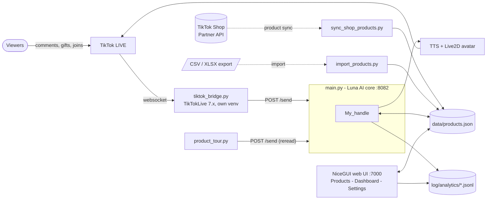
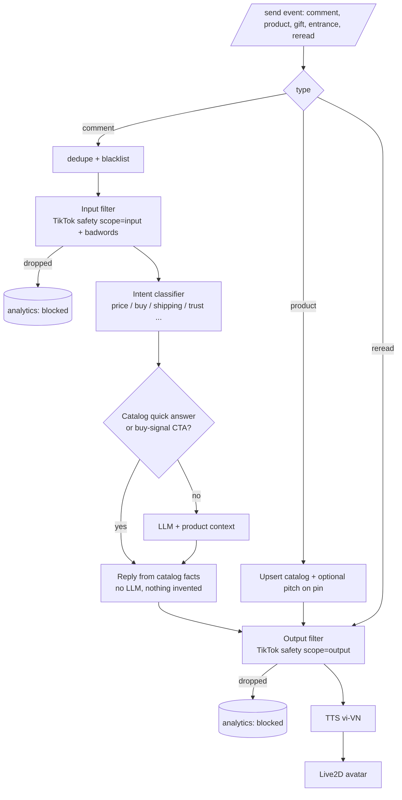

# Architecture

ai-live is an AI 2D-avatar seller for TikTok LIVE. This page explains how the pieces fit, why they are split the way they
are, and where to extend it.

## 1. System context

**Why two processes for TikTok?** `TikTokLive` pins protobuf/websocket versions that clash with the Luna AI stack, so the
bridge runs in its own virtualenv and talks to the core over a plain HTTP endpoint (`/send`). The same endpoint is used by
`product_tour.py`, which makes the tour just another event source.

## 2. Message pipeline

Key design rules:

1. **Facts come from the catalog, not the model.** Price, sizes, shipping and returns are answered from
   `data/products.json`; the LLM only gets the matching product as context. This is what keeps a sales bot honest.
2. **Filter both directions.** Viewers can bait the bot into saying banned things, and the model can drift on its own.
   `scope=input` guards what comes in, `scope=output` guards what the avatar says.
3. **Privacy by default.** Analytics stores a salted hash of the viewer name, never the name.

## 3. Modules

| Module | Responsibility | Notes |
|---|---|---|
| `tiktok_bridge.py` | TikTok websocket to HTTP events | comment, gift, join, pinned product, `--debug-cart` capture |
| `main.py`, `utils/my_handle.py` | Event routing, filters, LLM, TTS | inherited from Luna AI, trimmed to TikTok / YouTube / Twitch / chat |
| `utils/tiktok_safety.py` | Policy filter | accent-insensitive, leetspeak and spacing resistant; regex rules for phone, URL, handle; terms in JSON |
| `utils/product_catalog.py` | Catalog, pitches, quick answers, merge from pinned products | pure Python, no network, unit tested |
| `utils/tiktok_shop_api.py` | TikTok Shop Partner API client | HMAC-SHA256 signing, token refresh; unverified on a live shop |
| `utils/live_analytics.py` | Event log, intent detection, session summary, report | pure `summarize()` shared by app, dashboard and CLI |
| `utils/webui_products.py`, `utils/webui_dashboard.py` | Web UI tabs | NiceGUI |
| `product_tour.py` | Loops the cart and pitches each product | disclosure line, reminders, safety-checked |
| `import_products.py`, `sync_shop_products.py`, `report_session.py` | CLIs | spreadsheet import, API sync, post-live report |
| `utils/flash_sale.py` | Flash-sale scheduler | pure `next_announcement()`; state in `data/flash_sale.json`, ticked by a background thread in the app |
| `utils/catalog_enrich.py` | LLM catalog drafting | injected `llm_fn`, safety-filtered, never auto-saved |
| `utils/personas.py`, `data/personas.json` | Voice + style presets | compliance rules are always appended |
| `utils/setup_wizard.py`, `utils/webui_setup.py`, `launcher.py`, `start.bat` | Onboarding | wizard answers to `data/setup.json` + `config.json`; `ProcessManager` runs the bridge and tour |
| `utils/simulator.py`, `simulate_live.py`, `data/sim_scenario.json` | Demo / regression | offline verdicts (blocked / quick / buy_cta / llm) per comment, with `expect` checks used by tests |
| `utils/vieneu_tts.py`, `voice_server.py` | Free local Vietnamese TTS | HTTP client for a VieNeu OpenAI-style server in its own `venv_voice`; PCM wrapped as WAV; falls back to edge-tts when unreachable |
| `utils/webui_home.py`, `utils/home_status.py` | Home tab | readiness checklist, next action, last session, quick actions; checklist logic is pure and unit tested |
| `utils/recap.py` | Post-live recap | rule-based tips from one session summary, plus streak / weekly count from session file names; pure, unit tested |
| `utils/webui_theme.py`, `utils/webui_voice.py` | UI shell and Voice tab | CSS variables, dark/light, sidebar nav, status pills; voice lab with preview and server start/stop |

## 4. Data

- `data/products.json`: the catalog (see the sample). Hand-written fields are never overwritten by sync or import.
- `data/pitch_templates.json`: spoken templates (Vietnamese). Swap the file to change language.
- `data/tiktok_policy_terms.json`: categories with `scope`, `action` (`drop` or `mask`), and `accent_sensitive`.
- `log/analytics/session-*.jsonl`: one JSON object per event (`comment`, `answer`, `blocked`, `pitch`, `product_pop`, `gift`, `entrance`).

## 5. Testing

`python -m pytest tests/unit` covers the safety filter, catalog, importer, Partner API signing and analytics. The core
logic is deliberately kept free of NiceGUI / network imports so it stays testable.

## 6. Known limits and roadmap

- TikTok does not push the full cart over the websocket: only pinned products. Use the Partner API, a spreadsheet, or pin products.
- The Partner API client has not been run against a real shop yet.
- The wizard, flash-sale and draft UI were only smoke-tested (pages render); click-through in a browser is still to do.
- `product_tour.py` runs as its own process, so its pitches are not in the analytics log yet (route it through `/send` with a `source` field).
- The safety term list is a conservative starting point; TikTok's real enforcement is private and changes.
- Auto-spotlight (`My_handle.spotlight_handle`) re-pitches a product after N shopping questions in a window; tune `products.spotlight`.
- Ideas: multi-shop profiles, per-viewer follow-up memory, an A/B test of pitch templates using the buying-signal rate.
